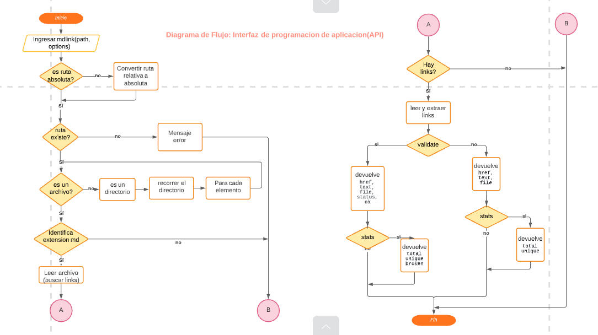
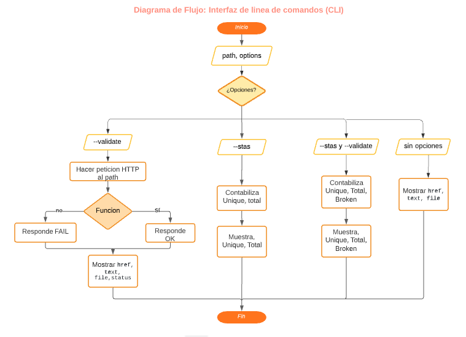

# Markdown Links

[Markdown](https://es.wikipedia.org/wiki/Markdown) es un lenguaje de marcado ligero muy popular entre developers. Es usado en muchísimas plataformas que manejan texto plano (GitHub, foros, blogs, ...), y es muy común encontrar varios archivos en ese formato en cualquier tipo de repositorio (empezando por el tradicional`README.md`).

Estos archivos`Markdown` normalmente contienen _links_  (vínculos/ligas) que muchas veces están rotos o ya no son válidos y eso perjudica mucho el valor de la información que se quiere compartir.

## Comenzado
### 1. ¿Que es MdLinks?
Mdlinks-Dora es una librería de Node.js que nos permite buscar en un directorio todos los archivos con extension (.md) y a partir de ello mostrar todos los links por cada archivo, asi mismo se podra validar el status de cada uno de ellos y tambien validarlos.
### 2. Diagramas de Flujo:
  - Interfaz de Programacion de Aplicación [ API ](https://lucid.app/lucidchart/71ca9e10-cb9e-4284-9590-5f91ce0367d6/edit?page=0_0#)
  
     

  - Interfaz de lineade comandos [ CLI ](https://lucid.app/lucidchart/7e02dd0b-5e88-4374-96ed-e17a951964c0/edit?page=YROYTysWf67v#)

       

### 3. Instalación :

Instala la librería con github: `npm install https://github.com/Dora-tech/back-mdlinks.git`

### 4. Herramientas Utilizadas :
La librería contiene las siguientes dependencias:

* Node-fetch

### 5. Uso de la librería :

* Utilizalo como libreria:
 ```js
const mdLinks = require("md-links");
```
* Ejemplo de uso:
```js
const mdLinks = require("md-links");

mdLinks("./some/example.md")
  .then((links) => {
    // => [{ href, text, file }, ...]
  })
  .catch(console.error);

mdLinks("./some/example.md", { validate: true })
  .then((links) => {
    // => [{ href, text, file, status, ok }, ...]
  })
  .catch(console.error);

mdLinks("./some/dir")
  .then((links) => {
    // => [{ href, text, file }, ...]
  })
  .catch(console.error);
```
### 6. Uso del CLI :


## Objetivos de aprendizaje
Recuerda colocar en esta seccion los objetivos de aprendizaje que quedaron pendientes de tu proyecto anterior.

### Javascript
- [x] Uso de condicionales (if-else | operador ternario).
- [x] Uso de bucles (forEach)
- [x] Uso de funciones (parámetros | argumentos | valor de retorno).
- [x] Declaración correcta de variables (const & let).
- [x] Manipular arrays (filter | map)
- [x] Manipular objects (key | value).
- [x] Uso de ES Modules (required (import) | exports).
- [x] Uso de callbacks
- [x] Consumo de Promesas
- [x] Creacion de Promesas
- [x] Recursión

### Node
- [x] Sistema de archivos
- [x] package.json
- [x] crear modules
- [x] Instalar y usar modules
- [ ] npm scripts
- [x] CLI (Command Line Interface - Interfaz de Línea de Comando)

### Testing
- [x] Testeo de tus funciones
- [x]] Testeo asíncrono

### Git y Github
- [x] Uso de comandos de git (add | commit | pull | status | push).
- [x] Manejo de repositorios de GitHub (clone | fork).

***
**Autor** : Dora Elizabeth Callisaya Choquecota.

**Generación** : LIM015 Laboratoria Perú.
***
